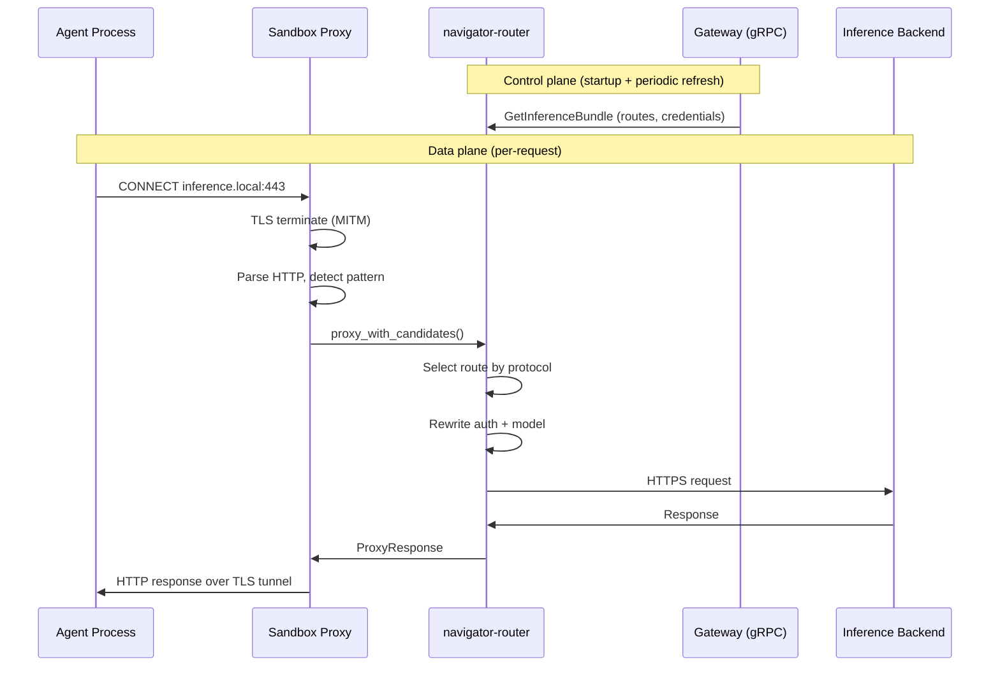

# Inference Routing

Inference routing gives sandboxed agents access to LLM APIs through a single, explicit endpoint: `inference.local`. There is no implicit catch-all interception for arbitrary hosts. Requests are routed only when the process targets `inference.local` via HTTPS and the request matches a supported inference API pattern.

All inference execution happens locally inside the sandbox via the `navigator-router` crate. The gateway is control-plane only: it stores configuration and delivers resolved route bundles to sandboxes over gRPC.

## Architecture Overview



## Provider Profiles

File: `crates/navigator-core/src/inference.rs`

`InferenceProviderProfile` is the single source of truth for provider-specific inference knowledge: default endpoint, supported protocols, credential key lookup order, auth header style, and default headers.

Three profiles are defined:

| Provider | Default Base URL | Protocols | Auth | Default Headers |
|----------|-----------------|-----------|------|-----------------|
| `openai` | `https://api.openai.com/v1` | `openai_chat_completions`, `openai_completions`, `openai_responses`, `model_discovery` | `Authorization: Bearer` | (none) |
| `anthropic` | `https://api.anthropic.com/v1` | `anthropic_messages`, `model_discovery` | `x-api-key` | `anthropic-version: 2023-06-01` |
| `nvidia` | `https://integrate.api.nvidia.com/v1` | `openai_chat_completions`, `openai_completions`, `openai_responses`, `model_discovery` | `Authorization: Bearer` | (none) |

Each profile also defines `credential_key_names` (e.g. `["OPENAI_API_KEY"]`) and `base_url_config_keys` (e.g. `["OPENAI_BASE_URL"]`) used by the gateway to resolve credentials and endpoint overrides from provider records.

Unknown provider types return `None` from `profile_for()` and default to `Bearer` auth with no default headers via `auth_for_provider_type()`.

## Control Plane (Gateway)

File: `crates/navigator-server/src/inference.rs`

The gateway implements the `Inference` gRPC service defined in `proto/inference.proto`.

### Cluster inference set/get

`SetClusterInference` takes a `provider_name` and `model_id`. It:

1. Validates that both fields are non-empty.
2. Fetches the named provider record from the store.
3. Validates the provider by resolving its route (checking that the provider type is supported and has a usable API key).
4. Builds a managed route spec that stores only `provider_name` and `model_id`. The spec intentionally leaves `base_url`, `api_key`, and `protocols` empty -- these are resolved dynamically at bundle time from the provider record.
5. Upserts the route with name `inference.local`. Version starts at 1 and increments monotonically on each update.

`GetClusterInference` returns `provider_name`, `model_id`, and `version` for the managed route. Returns `NOT_FOUND` if cluster inference is not configured.

### Bundle delivery

`GetInferenceBundle` resolves the managed route at request time:

1. Loads the `inference.local` route from the store.
2. Looks up the referenced provider record by `provider_name`.
3. Resolves endpoint, API key, protocols, and provider type from the provider record using the `InferenceProviderProfile` registry.
4. If the provider's config map contains a base URL override key (e.g. `OPENAI_BASE_URL`), that value overrides the profile default.
5. Returns a `GetInferenceBundleResponse` with the resolved route(s), a revision hash (DefaultHasher over route fields), and `generated_at_ms` timestamp.

Because resolution happens at request time, credential rotation and endpoint changes on the provider record take effect on the next bundle fetch without re-running `SetClusterInference`.

An empty route list is valid and indicates cluster inference is not yet configured.

### Proto definitions

File: `proto/inference.proto`

Key messages:

- `SetClusterInferenceRequest` -- `provider_name` + `model_id`
- `SetClusterInferenceResponse` -- `provider_name` + `model_id` + `version`
- `GetInferenceBundleResponse` -- `repeated ResolvedRoute routes` + `revision` + `generated_at_ms`
- `ResolvedRoute` -- `name`, `base_url`, `protocols`, `api_key`, `model_id`, `provider_type`

## Data Plane (Sandbox)

Files:

- `crates/navigator-sandbox/src/proxy.rs` -- proxy interception, inference context, request routing
- `crates/navigator-sandbox/src/l7/inference.rs` -- pattern detection, HTTP parsing, response formatting
- `crates/navigator-sandbox/src/lib.rs` -- inference context initialization, route refresh
- `crates/navigator-sandbox/src/grpc_client.rs` -- `fetch_inference_bundle()`

### Interception flow

The proxy handles only `CONNECT` requests to `inference.local`. Non-CONNECT requests (any method, any host) are rejected with `403`.

When a `CONNECT inference.local:443` arrives:

1. Proxy responds `200 Connection Established`.
2. `handle_inference_interception()` TLS-terminates the client connection using the sandbox CA (MITM).
3. Raw HTTP requests are parsed from the TLS tunnel using `try_parse_http_request()` (supports Content-Length and chunked transfer encoding).
4. Each parsed request is passed to `route_inference_request()`.
5. The tunnel supports HTTP keep-alive: multiple requests can be processed sequentially.
6. Buffer starts at 64 KiB (`INITIAL_INFERENCE_BUF`) and grows up to 10 MiB (`MAX_INFERENCE_BUF`). Requests exceeding the max get `413 Payload Too Large`.

### Request classification

File: `crates/navigator-sandbox/src/l7/inference.rs` -- `default_patterns()` and `detect_inference_pattern()`

Supported built-in patterns:

| Method | Path | Protocol | Kind |
|--------|------|----------|------|
| `POST` | `/v1/chat/completions` | `openai_chat_completions` | `chat_completion` |
| `POST` | `/v1/completions` | `openai_completions` | `completion` |
| `POST` | `/v1/responses` | `openai_responses` | `responses` |
| `POST` | `/v1/messages` | `anthropic_messages` | `messages` |
| `GET` | `/v1/models` | `model_discovery` | `models_list` |
| `GET` | `/v1/models/*` | `model_discovery` | `models_get` |

Query strings are stripped before matching. Path matching is exact for most patterns; `/v1/models/*` matches any sub-path (e.g. `/v1/models/gpt-4.1`). Absolute-form URIs (e.g. `https://inference.local/v1/chat/completions`) are normalized to path-only form by `normalize_inference_path()` before detection.

If no pattern matches, the proxy returns `403 Forbidden` with `{"error": "connection not allowed by policy"}`.

### Route cache

- `InferenceContext` holds a `Router`, the pattern list, and an `Arc<RwLock<Vec<ResolvedRoute>>>` route cache.
- In cluster mode, `spawn_route_refresh()` polls `GetInferenceBundle` every 30 seconds (`ROUTE_REFRESH_INTERVAL_SECS`). On failure, stale routes are kept.
- In file mode (`--inference-routes`), routes load once at startup from YAML. No refresh task is spawned.
- In cluster mode, an empty initial bundle still enables the inference context so the refresh task can pick up later configuration.

### Bundle-to-route conversion

`bundle_to_resolved_routes()` in `lib.rs` converts proto `ResolvedRoute` messages to router `ResolvedRoute` structs. Auth header style and default headers are derived from `provider_type` using `navigator_core::inference::auth_for_provider_type()`.

## Router Behavior

Files:

- `crates/navigator-router/src/lib.rs` -- `Router`, `proxy_with_candidates()`
- `crates/navigator-router/src/backend.rs` -- `proxy_to_backend()`, URL construction
- `crates/navigator-router/src/config.rs` -- `RouteConfig`, `ResolvedRoute`, YAML loading

### Route selection

`proxy_with_candidates()` finds the first route whose `protocols` list contains the detected source protocol (normalized to lowercase). If no route matches, returns `RouterError::NoCompatibleRoute`.

### Request rewriting

`proxy_to_backend()` rewrites outgoing requests:

1. **Auth injection**: Uses the route's `AuthHeader` -- either `Authorization: Bearer <key>` or a custom header (e.g. `x-api-key: <key>` for Anthropic).
2. **Header stripping**: Removes `authorization`, `x-api-key`, `host`, and any header names that will be set from route defaults.
3. **Default headers**: Applies route-level default headers (e.g. `anthropic-version: 2023-06-01`) unless the client already sent them.
4. **Model rewrite**: Parses the request body as JSON and replaces the `model` field with the route's configured model. Non-JSON bodies are forwarded unchanged.
5. **URL construction**: `build_backend_url()` appends the request path to the route endpoint. If the endpoint already ends with `/v1` and the request path starts with `/v1/`, the duplicate prefix is deduplicated.

### Header sanitization

Before forwarding inference requests, the proxy strips sensitive and hop-by-hop headers from both requests and responses:

- **Request**: `authorization`, `x-api-key`, `host`, `content-length`, and hop-by-hop headers (`connection`, `keep-alive`, `proxy-authenticate`, `proxy-authorization`, `proxy-connection`, `te`, `trailer`, `transfer-encoding`, `upgrade`).
- **Response**: `content-length` and hop-by-hop headers.

### Mock routes

File: `crates/navigator-router/src/mock.rs`

Routes with `mock://` scheme endpoints return canned responses without making HTTP requests. Mock responses are protocol-aware (OpenAI chat completion, OpenAI completion, Anthropic messages, or generic JSON). Mock routes include an `x-navigator-mock: true` response header.

### HTTP client

The router uses a `reqwest::Client` with a 60-second timeout. Timeouts and connection failures map to `RouterError::UpstreamUnavailable`.

## Standalone Route File

File: `crates/navigator-router/src/config.rs`

Standalone sandboxes can load static routes from YAML via `--inference-routes`:

```yaml
routes:
  - route: inference.local
    endpoint: http://localhost:1234/v1
    model: local-model
    protocols: [openai_chat_completions]
    api_key: lm-studio
    # Or reference an environment variable:
    # api_key_env: OPENAI_API_KEY
```

Fields:

- `route` -- route name (informational)
- `endpoint` -- backend base URL
- `model` -- model ID to force on outgoing requests
- `protocols` -- list of supported protocol strings
- `provider_type` -- optional; determines auth style and default headers via `InferenceProviderProfile`
- `api_key` -- inline API key (mutually exclusive with `api_key_env`)
- `api_key_env` -- environment variable name containing the API key

Validation at load time requires either `api_key` or `api_key_env` to resolve, and at least one protocol. Protocols are normalized (lowercased, trimmed, deduplicated).

## Error Model

| Status | Condition |
|--------|-----------|
| `403` | Request on `inference.local` does not match a recognized inference API pattern |
| `503` | Pattern matched but route cache is empty (cluster inference not configured) |
| `400` | No compatible route for the detected source protocol |
| `401` | Upstream returned unauthorized |
| `502` | Upstream protocol error or internal router error |
| `503` | Upstream unavailable (timeout or connection failure) |
| `413` | Request body exceeds 10 MiB buffer limit |

## CLI Surface

Cluster inference commands:

- `nemoclaw cluster inference set --provider <name> --model <id>` -- configures cluster inference by referencing a provider record name
- `nemoclaw cluster inference get` -- displays current cluster inference configuration

The `--provider` flag references a provider record name (not a provider type). The provider must already exist in the cluster and have a supported inference type (`openai`, `anthropic`, or `nvidia`).

## Provider Discovery

Files:

- `crates/navigator-providers/src/lib.rs` -- `ProviderRegistry`, `ProviderPlugin` trait
- `crates/navigator-providers/src/providers/openai.rs` -- `OpenaiProvider`
- `crates/navigator-providers/src/providers/anthropic.rs` -- `AnthropicProvider`
- `crates/navigator-providers/src/providers/nvidia.rs` -- `NvidiaProvider`

Provider discovery and inference routing are separate concerns:

- `ProviderPlugin` (in `navigator-providers`) handles credential *discovery* -- scanning environment variables to find API keys.
- `InferenceProviderProfile` (in `navigator-core`) handles how to *use* discovered credentials to make inference API calls.

The `openai`, `anthropic`, and `nvidia` provider plugins each discover credentials from their canonical environment variable (`OPENAI_API_KEY`, `ANTHROPIC_API_KEY`, `NVIDIA_API_KEY`). These credentials are stored in provider records and looked up by the gateway at bundle resolution time.
